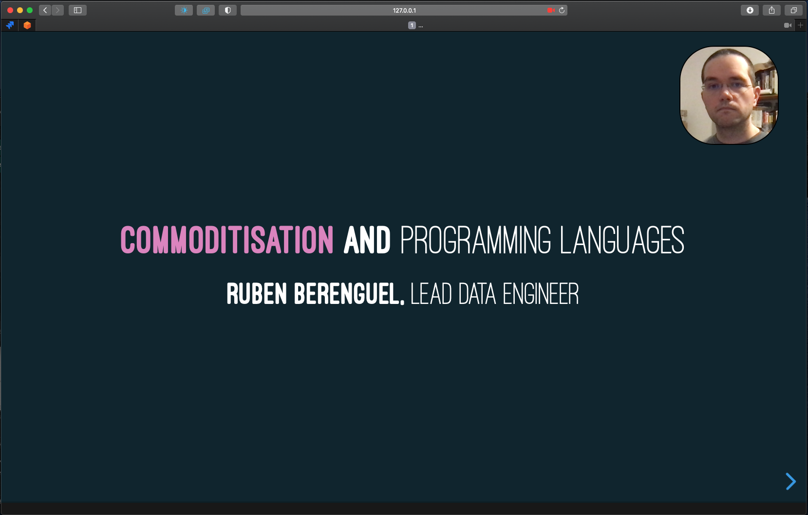

# GuillotineJS

- [GuillotineJS](#guillotine)
  - [Installation](#installation)
  - [Controls](#controls)
  - [Caveats](#caveats)
  
  
Recording a presentation while showing your webcam is sometimes a bit tricky. You can get by with [OBS](https://obsproject.com), but it's a bit overkill when you just want to give a talk from time to time.

---

**GuillotineJS** is a bit of Javascript that allows you to have a floating HTML element with your webcam in web presentations.

</a>

See also [Guillotine](https://github.com/rberenguel/Guillotine) for a cross-platform native (Electron) app. _GuillotineJS_ can solve the issue of _Guillotine_ not working for full-screen presentations.

---

_GuillotineJS_ shares the core ideas of _Guillotine_, but with simpler code. It uses the drag controls from my [generative sketches GUI helper](https://mostlymaths.net/2020/05/blot-painting-p5js-sketch.html/#the-gui), and since it lives in one window, doesn't need as much code.

## Installation

#### For third party websites/slides
 
To use _GuillotineJS_ as a bookmarklet in _a_ website you need to use either Firefox or Chrome, since you need a browser where you can disable Content Security Policy. This is potentially risky, so be sure you only deactivate it temporarily.

- In Firefox, you need to disable `security.csp.enable` in the `about:config` menu. This is a global setting, so it is recommended to install a version of Firefox with this setting. 
- In Chrome, you should install an extension that lets you disable CSP (I have tried [this one](https://chrome.google.com/webstore/detail/disable-content-security/ieelmcmcagommplceebfedjlakkhpden?hl=en))

Once you have any of these, you can add these two links to your bookmarks:

- [Guillotine](javascript:(function(){document.body.appendChild(document.createElement('script')).src='https://github.com/rberenguel/guillotinejs/raw/master/src/guillotine.js';})();) After disabling CSP, press the bookmarklet.
- [Guillotine in Google Slides](javascript:(function(){document.querySelector(".punch-present-iframe").contentDocument.body.appendChild(document.createElement('script')).src='https://github.com/rberenguel/guillotinejs/raw/master/src/guillotine.js';})();) To use it in Google Slides, activate `Present mode`, and move your mouse up so your `Bookmarks` menu shows, then click this bookmarklet.

In code, they respectively are:
- `javascript:(function(){document.body.appendChild(document.createElement('script')).src='https://github.com/rberenguel/guillotinejs/raw/master/src/guillotine.js';})();`
- `javascript:(function(){document.querySelector(".punch-present-iframe").contentDocument.body.appendChild(document.createElement('script')).src='https://github.com/rberenguel/guillotinejs/raw/master/src/guillotine.js';})();`

Drag-and-dropping them from this `README` to your bookmarks bar should work. Otherwise, create a bookmark to this page, edit it and add the code above to the link field.

#### For self-hosted presentations

For instance, presentations created with [reveal.js](https://revealjs.com), maybe using [Haskset](https://github.com/rberenguel/haskset). You only need to add [guillotine.js](src/guillotine.js) to your HTML presentation, by adding it an imported script. 

## Controls

After loading it (either as an import or via the bookmarklet), press `Ctrl-Alt-V` to get a modal view of your camera (you can choose which camera if there are more than one, although on Mac OS this does not work in Safari). 

Click on the cutoff frame to give it keyboard focus, then
- Scroll wheel in the frame to resize it (larger or smaller),
- Drag it around to select what to capture,
- `+`/`-` to make it larger or smaller via keyboard,
- `S`/`R` to make the frame `S`quarer or `R`ounder,
- `Space` to create the floating element with the currently focused area
- All controls except `space` work after creating the element, so you can resize the frame, move it around or reshape it.

## Caveats

* Currently the keyboard controls do not work in the Google Slides version, since Google Slides in present mode works in an iFrame, keypresses are captured in a different scope. I need to think how to best address this.
* There are some usability improvements to add to the keyboard controls, as well as adding some kind of help.
* The code needs a good cleanup, there are many repeated and non-configurable constants.
* There are no tests, basically there is not a lot that is easily testable here. I'm open to ideas.
---

